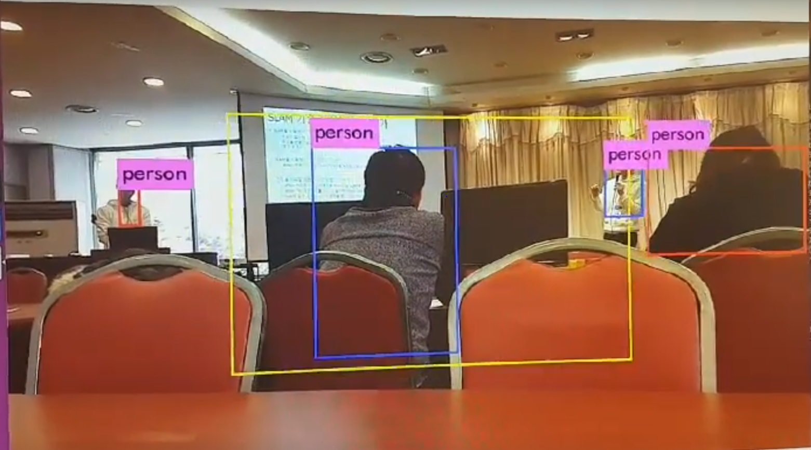

모두의연구소 AI플레이톤 ( 임베디드 AI 인공지능 활용 해커톤 )에서 우수상을 수상한 프로젝트입니다.

· 작업 기간 : 2018-12-13 ~ 2018-12-14 (2일)
· 작업 인원 : 2 명
· 작업 도구 : C, yolo, Jetson Tx2
· 작품소개 : Jetson Tx2와 Yolo를 이용한 임베디드 AI 로봇이 제공되었고, 저희 팀은 사각형 범위를 설정해 그 범위 안에 있는 사람만을 인식하도록 코드를 수정했습니다.

시연 영상 URL : https://youtu.be/eQWPj4fFUR4

해커톤 영상 : 
<ul>
  <li>
모두의연구소 해커톤(임베디드 AI 플레이 그라운드)을 진행합니다!!! : https://www.youtube.com/watch?v=otX1WgKkeqY
  </li>
  <li>
모두의연구소 임베디드 AI 해커톤 : https://www.youtube.com/watch?v=oZx4VGRWwz0&t=9315s
  </li>
  <li>
모두의연구소 AI플레이톤 해커톤 진행영상 : https://www.youtube.com/watch?v=ZR2q_tMMKCk&t=693s
  </li>
</ul>

This is Hackathon file made by Sanggun Kim & Gwangho Kim.
